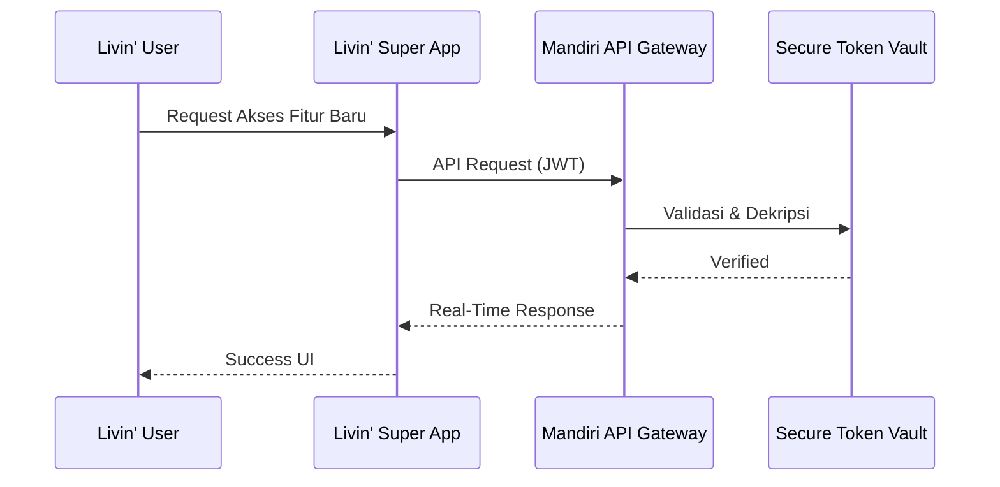

 

---

---

## Next-Gen Livin' by Mandiri

### *Gagasan & Transformasi Digital Bank Mandiri Masa Depan*

 

**Kajian Independen • Digital Banking • Artificial Intelligence • Web3 • Future Finance**

Repositori ini berisi kajian, analisis, dan gagasan inovatif mengenai evolusi **Livin' by Mandiri** sebagai generasi berikutnya dari *digital banking ecosystem*.

---

# 📖 Tentang Proyek

Livin' by Mandiri telah berkembang dari aplikasi *mobile banking* menjadi **super-app finansial** yang melayani jutaan pengguna.

Melalui karya tulis ini, disajikan berbagai ide dan pendekatan teknologi modern yang berpotensi menjadi inspirasi pengembangan masa depan, meliputi:

- 🤖 Artificial Intelligence
- 🌐 Web3 & Digital Asset
- ☁️ Cloud Native Architecture
- 🔐 Zero Trust Security
- 📊 Hyper Personalization
- 📱 Modular User Experience

---

# 🎯 Visi

Membangun konsep **Next Generation Livin'** yang mampu menjadi:

- ✅ Lebih Personal
- ✅ Lebih Aman
- ✅ Lebih Adaptif
- ✅ Lebih Cerdas
- ✅ Lebih Modern

---

# 💡 Pilar Inovasi

## 🤖 Hyper-Personalized AI Assistant *(Livin' Genius)*

- Mempelajari pola transaksi pengguna
- Memberikan rekomendasi penghematan
- Membuat prediksi cashflow
- Memberikan insight investasi
- AI Financial Advisor berbasis lokal

---

## 🌐 Web3 & Digital Asset Integration

- Digital Rupiah (CBDC Ready)
- Secure Token Vault
- Multi Asset Portfolio
- Blockchain Verification
- Future Banking Infrastructure

---

## 🧩 Modular & Gamified UI/UX *(Livin' Playground)*

- Minimal Mode
- Business Dashboard
- Classic Banking
- Gamification Experience
- Widget Customization

---

# 📚 Daftar Isi

Repositori ini disusun secara bertahap mulai dari analisis bisnis, perancangan fitur, hingga arsitektur teknis dan keamanan aplikasi.

| Bab | Dokumen | Deskripsi |
|------|----------|-----------|
| 📖 Bab 1 | [Pendahuluan & Tren Perbankan Global](docs/01-pendahuluan.md) | Latar belakang, visi transformasi digital, dan tren industri perbankan masa depan. |
| 📊 Bab 2 | [Analisis Kritis & UX Pain Points Livin'](docs/02-analisis-pasar.md) | Analisis pengalaman pengguna, kompetitor, dan peluang inovasi produk. |
| 💡 Bab 3 | [Usulan Fitur Baru (The Future Blueprint)](docs/03-usulan-fitur.md) | Blueprint fitur inovatif seperti AI Assistant, Secure Token Vault, CBDC Gateway, dan Classic Clean Mode. |
| 🏗️ Bab 4 | [Arsitektur Sistem, API & Kepatuhan Regulasi](docs/04-arsitektur-tren.md) | Desain arsitektur, Open Banking API, integrasi backend, serta standar keamanan dan regulasi. |
| 🔐 Bab 5 | [Enterprise Security Architecture](docs/05-arsitektur-keamanan.md) | Zero Trust Architecture, Identity & Access Management, enkripsi, keamanan jaringan, dan strategi pertahanan berlapis. |
| 🛡️ Bab 6 | [Application Shielding & Proteksi Aplikasi](docs/06-proteksi-aplikasi.md) | Strategi perlindungan aplikasi mobile terhadap reverse engineering, tampering, serta peningkatan keamanan sisi klien. |
| ⚡ Bab 7 | [Pemantauan Performa & Optimasi Latensi](docs/07-pemantauan-performa.md) | Observability, monitoring, pengukuran performa transaksi, optimasi sistem, dan target SLA/SLO. |

---

# 🛠️ Pendekatan Teknologi

- Open Banking API
- OAuth2 & JWT Authentication
- Zero Trust Architecture
- Microservices
- Event Driven Architecture
- Cloud Native Infrastructure
- AI Recommendation Engine

---

# 🔄 Contoh Arsitektur

---

# 🌟 Highlight

| Fokus | Deskripsi |
|--------|-----------|
| 🤖 AI | Hyper Personalized Financial Assistant |
| 🌐 Web3 | Digital Asset & CBDC Readiness |
| 🔐 Security | Zero Trust & Secure Vault |
| ☁️ Cloud | Modern Cloud Native Architecture |
| 📱 UX | Modular & Adaptive Dashboard |

---

# 📌 Tujuan Penelitian

- 📖 Kajian Akademik
- 💡 Kontribusi Ide
- 🚀 Future Digital Banking Research
- 🇮🇩 Mendukung inovasi teknologi finansial Indonesia

---

# ⚠️ Disclaimer

> Karya tulis ini merupakan analisis, opini, dan gagasan independen penulis.
>
> Seluruh isi repositori bersifat **non-komersial**, tidak mewakili Bank Mandiri maupun afiliasi resminya. Dokumen ini disusun sebagai bentuk kontribusi ide, penelitian, dan eksplorasi inovasi teknologi finansial di Indonesia.

---

### ⭐ Jika proyek ini menarik, jangan lupa berikan Star!

Made with ❤️ by **Kongali1720**

---

## 🌐 Project Ecosystem

| Project | Description | Status |
|----------|-------------|:------:|
| **KongaliCoin ID** | Web3 ecosystem and blockchain platform | 🟢 Active |
| **KongaliCoin** | ERC-20 smart contract ecosystem | 🟢 Active |
| **YOUNEXT Cloud** | Cloud infrastructure and security platform | 🟢 Active |
| **ZLCLOTH Industries** | Enterprise digital solutions | 🟢 Active |

---

## ☕ Support the Project

If this project has helped your research, learning, or security operations, consider supporting its continued development.

