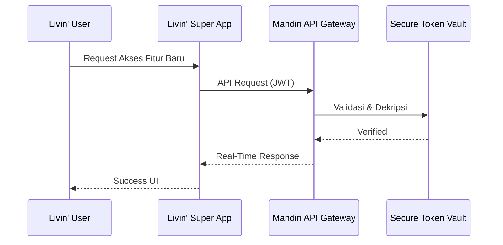

# Next-Gen Livin' by Mandiri
### *Gagasan & Transformasi Digital Bank Mandiri Masa Depan*

---

**Kajian Independen • Digital Banking • Artificial Intelligence • Web3 • Future Finance**

Repositori ini berisi kajian, analisis, dan gagasan inovatif mengenai evolusi **Livin' by Mandiri** sebagai generasi berikutnya dari *digital banking ecosystem*.

---

# 📖 Tentang Proyek

Livin' by Mandiri telah berkembang dari aplikasi *mobile banking* menjadi **super-app finansial** yang melayani jutaan pengguna.

Melalui karya tulis ini, disajikan berbagai ide dan pendekatan teknologi modern yang berpotensi menjadi inspirasi pengembangan masa depan, meliputi:

- 🤖 Artificial Intelligence
- 🌐 Web3 & Digital Asset
- ☁️ Cloud Native Architecture
- 🔐 Zero Trust Security
- 📊 Hyper Personalization
- 📱 Modular User Experience

---

# 🎯 Visi

Membangun konsep **Next Generation Livin'** yang mampu menjadi:

- ✅ Lebih Personal
- ✅ Lebih Aman
- ✅ Lebih Adaptif
- ✅ Lebih Cerdas
- ✅ Lebih Modern

---

# 💡 Pilar Inovasi

## 🤖 1. Hyper-Personalized AI Assistant *(Livin' Genius)*

AI yang tidak hanya menjawab pertanyaan pengguna, tetapi mampu:

- Mempelajari pola transaksi
- Memberikan rekomendasi penghematan
- Membuat prediksi cashflow
- Memberikan insight investasi
- Financial advisor berbasis AI lokal

---

## 🌐 2. Web3 & Digital Asset Integration

Eksplorasi konsep:

- Digital Rupiah (CBDC Ready)
- Secure Token Vault
- Multi Asset Portfolio
- Blockchain Verification
- Future Digital Banking Infrastructure

---

## 🧩 3. Modular & Gamified UI/UX *(Livin' Playground)*

Konsep antarmuka yang dapat disesuaikan pengguna:

- Minimal Mode
- Business Dashboard
- Classic Banking
- Gamification Experience
- Widget Customization

---

# 📚 Daftar Isi

| Bab | Pembahasan |
|------|------------|
| 📖 | [Pendahuluan & Tren Perbankan Global](docs/01-pendahuluan.md) |
| 📊 | [Analisis UX & Pain Points Livin'](docs/02-analisis-pasar.md) |
| 🚀 | [Blueprint Fitur Masa Depan](docs/03-usulan-fitur.md) |
| 🏗️ | [Arsitektur Sistem & Keamanan](docs/04-arsitektur-tren.md) |

---

# 🛠️ Pendekatan Teknologi

Repositori ini membahas implementasi konseptual menggunakan:

- Open Banking API
- OAuth2 & JWT Authentication
- Zero Trust Architecture
- Microservices
- Event Driven Architecture
- Cloud Native Infrastructure
- AI Recommendation Engine

---

# 🔄 Contoh Arsitektur

---

# 🌟 Highlight

| Fokus | Deskripsi |
|--------|-----------|
| 🤖 AI | Hyper Personalized Financial Assistant |
| 🌐 Web3 | Digital Asset & CBDC Readiness |
| 🔐 Security | Zero Trust & Secure Vault |
| ☁️ Cloud | Modern Cloud Native Architecture |
| 📱 UX | Modular & Adaptive Dashboard |

---

# 📌 Tujuan Penelitian

Repositori ini dibuat sebagai:

- 📖 Kajian akademik
- 💡 Kontribusi ide
- 🚀 Future Digital Banking Research
- 🇮🇩 Dukungan terhadap inovasi teknologi finansial Indonesia

---

# ⚠️ Disclaimer

> **Karya tulis ini merupakan analisis, opini, dan gagasan independen penulis.**
>
> Seluruh isi repositori bersifat **non-komersial**, tidak mewakili Bank Mandiri maupun afiliasi resmi lainnya, dan disusun sebagai bentuk kontribusi ide, penelitian, serta eksplorasi inovasi teknologi finansial di Indonesia.

---

### ⭐ Jika proyek ini menarik, jangan lupa berikan Star.

Made with ❤️ by **Kongali1720**

