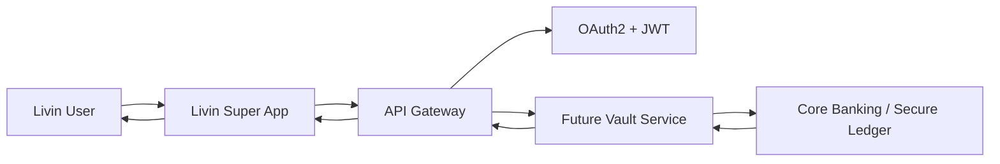

# 🛠️ Bab 4: Usulan Arsitektur Sistem, Kepatuhan Regulasi, & Implementasi API

Dokumen ini memuat spesifikasi teknis usulan untuk integrasi fitur masa depan pada **Livin' by Mandiri**, menggunakan standar **Open Banking**, arsitektur keamanan tingkat tinggi, serta contoh implementasi backend.

---

# 1. Spesifikasi API Modern (Standar Open Banking)

Sesuai dengan **Standar Nasional Open API Pembayaran (SNAP)** yang ditetapkan oleh **Bank Indonesia**, seluruh API yang diusulkan menggunakan format yang terstandardisasi, aman, dan modular.

Berikut contoh spesifikasi menggunakan **OpenAPI 3.0**.

```yaml
openapi: 3.0.3

info:
  title: Next-Gen Livin' by Mandiri - Future Features API
  description: >
    Spesifikasi API konseptual untuk fitur inovasi masa depan
    Livin' by Mandiri (SNAP Compliant).
  version: 1.0.0

paths:
  /api/v1/livin/future-vault/balance:
    get:
      summary: Mendapatkan informasi saldo Future Vault pengguna

      security:
        - BearerAuth: []
        - X-Signature: []

      responses:
        "200":
          description: Berhasil mengambil data saldo
          content:
            application/json:
              schema:
                type: object
                properties:
                  responseCode:
                    type: string
                    example: "2004700"

                  responseMessage:
                    type: string
                    example: "Successful"

                  responseData:
                    type: object
                    properties:
                      accountNumber:
                        type: string
                        example: "172000XXXXXX"

                      totalBalance:
                        type: string
                        example: "15000000.00"

                      currency:
                        type: string
                        example: "IDR"

        "401":
          description: Unauthorized

components:
  securitySchemes:

    BearerAuth:
      type: http
      scheme: bearer
      bearerFormat: JWT

    X-Signature:
      type: apiKey
      in: header
      name: X-Signature
```

---

# 2. Implementasi Backend (Kotlin)

Berikut contoh implementasi menggunakan **Ktor Framework** sebagai backend server.

```kotlin
package com.mandiri.livin.future.controller

import io.ktor.http.*
import io.ktor.server.application.*
import io.ktor.server.auth.*
import io.ktor.server.response.*
import io.ktor.server.routing.*
import kotlinx.serialization.Serializable

@Serializable
data class VaultBalanceResponse(
    val responseCode: String,
    val responseMessage: String,
    val responseData: VaultData
)

@Serializable
data class VaultData(
    val accountNumber: String,
    val totalBalance: String,
    val currency: String
)

fun Application.configureFutureVaultRoutes() {

    routing {

        authenticate("livin-jwt") {

            route("/api/v1/livin/future-vault") {

                get("/balance") {

                    // Validasi Header Signature
                    val signature = call.request.headers["X-Signature"]

                    if (signature.isNullOrBlank()) {
                        call.respond(
                            HttpStatusCode.Unauthorized,
                            "Missing X-Signature Header"
                        )
                        return@get
                    }

                    // Simulasi data dari Core Banking
                    val response = VaultBalanceResponse(
                        responseCode = "2004700",
                        responseMessage = "Successful",
                        responseData = VaultData(
                            accountNumber = "172000XXXXXX",
                            totalBalance = "15000000.00",
                            currency = "IDR"
                        )
                    )

                    call.respond(HttpStatusCode.OK, response)
                }
            }
        }
    }
}
```

---

# 3. Arsitektur Sistem



---

# 4. Lapisan Keamanan

| Layer | Teknologi |
|-------|-----------|
| Authentication | OAuth2 + JWT |
| Authorization | Role Based Access Control |
| Request Validation | X-Signature |
| Encryption | TLS 1.3 + AES-256 |
| API Standard | SNAP Open API |
| Audit | Immutable Audit Log |
| Fraud Detection | AI Risk Engine |

---

# 5. Kepatuhan Regulasi

Konsep implementasi mengacu pada berbagai standar dan regulasi yang berlaku di Indonesia, antara lain:

- SNAP (Standar Nasional Open API Pembayaran)
- Peraturan Bank Indonesia mengenai Open Banking
- POJK mengenai Perlindungan Konsumen
- ISO 27001
- ISO 27701
- PCI DSS
- OWASP API Security Top 10
- Zero Trust Architecture

---

> **Catatan:** Seluruh contoh API, struktur backend, dan arsitektur pada dokumen ini merupakan ilustrasi konseptual untuk kepentingan penelitian dan tidak merepresentasikan implementasi internal Bank Mandiri.
