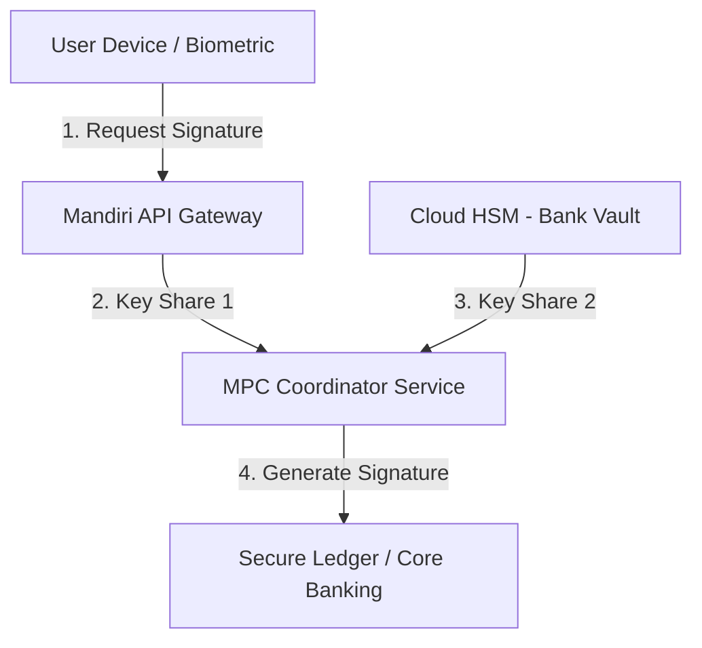

# 🔒 Bab 5: Arsitektur Keamanan & Proteksi Aset Digital

Dokumen ini menjelaskan rancangan keamanan berlapis untuk melindungi data finansial dan kunci kriptografis pengguna pada fitur **Secure Token Vault** di dalam ekosistem Livin'.

---

## 1. Manajemen Kunci Kriptografi (Key Management)

Untuk mengamankan aset digital dan tanda tangan transaksi (misalnya CBDC atau token digital), sistem diusulkan menggunakan kombinasi teknologi **HSM (Hardware Security Module)** dan **MPC (Multi-Party Computation)**.

