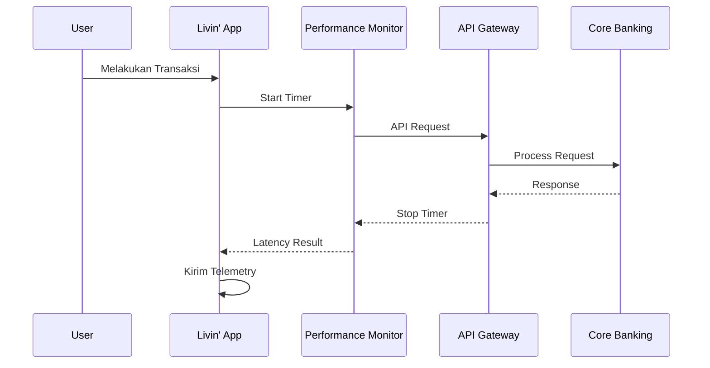

## *Performance Engineering & Observability*

Kecepatan merupakan salah satu faktor utama dalam pengalaman pengguna aplikasi perbankan digital. Setiap peningkatan latensi dapat berdampak pada kepuasan nasabah, tingkat keberhasilan transaksi, hingga efisiensi operasional.

Dokumen ini menjelaskan pendekatan konseptual untuk mengukur, memantau, dan mengoptimalkan performa layanan pada **Livin' by Mandiri**, mulai dari aplikasi mobile hingga layanan backend.

---

# 🎯 Tujuan

Implementasi sistem pemantauan performa bertujuan untuk:

- Mengukur latensi transaksi secara konsisten
- Mengidentifikasi bottleneck sedini mungkin
- Mendukung proses observability end-to-end
- Menjaga stabilitas layanan saat trafik tinggi
- Meningkatkan pengalaman pengguna

---

# 1. Arsitektur Pemantauan Latensi



Seluruh metrik performa dapat dikirim ke platform **Application Performance Monitoring (APM)** untuk dianalisis secara terpusat.

---

# 2. Pengukuran Performa

## A. Latensi API

Contoh pengukuran durasi pemanggilan layanan backend.

```kotlin
import kotlin.system.measureTimeMillis

val latency = measureTimeMillis {
    vaultService.fetchUpdatedBalance()
}

if (latency > 2_000) {
    telemetryLogger.warn(
        "High latency detected: ${latency} ms"
    )
}
```

Pengukuran ini membantu mendeteksi layanan yang mengalami peningkatan waktu respons sebelum berdampak pada pengguna.

---

## B. Performa Operasi Kriptografi

Operasi kriptografi bersifat sensitif terhadap performa karena sering digunakan dalam proses autentikasi dan penandatanganan transaksi.

```kotlin
import kotlin.system.measureNanoTime

val signingTime = measureNanoTime {
    signatureGenerator.signPayload(transactionPayload)
}

telemetryLogger.debug(
    "Signing completed in ${signingTime} ns"
)
```

Pengukuran pada tingkat nanodetik memberikan gambaran mengenai efisiensi algoritma tanpa memengaruhi pengalaman pengguna secara signifikan.

---

# 3. Dashboard Observability

Metrik performa yang direkomendasikan untuk dipantau meliputi:

| Metrik | Tujuan |
|---------|---------|
| API Response Time | Mengukur waktu respons layanan |
| Transaction Duration | Mengukur durasi transaksi |
| Error Rate | Persentase kegagalan transaksi |
| Success Rate | Tingkat keberhasilan transaksi |
| CPU Usage | Beban komputasi layanan |
| Memory Usage | Konsumsi memori |
| Network Latency | Latensi komunikasi jaringan |
| Database Query Time | Performa basis data |

---

# 4. Strategi Optimasi

## ⚡ API Optimization

- Connection Pooling
- HTTP/2
- Compression
- Response Caching
- Asynchronous Processing

---

## ☁️ Backend Optimization

- Microservices Scaling
- Database Indexing
- Query Optimization
- Read Replica
- Distributed Cache

---

## 📱 Mobile Optimization

- Lazy Loading
- Image Compression
- Background Synchronization
- Offline Cache
- Incremental Rendering

---

# 5. Target SLA & SLO

Sebagai ilustrasi, target performa layanan dapat dirumuskan sebagai berikut.

| Komponen | Target |
|----------|---------|
| Login | < 2 detik |
| Dashboard | < 1,5 detik |
| Transfer | < 3 detik |
| QRIS Payment | < 2 detik |
| API Availability | ≥ 99,9% |
| Crash Rate | < 0,1% |

Target tersebut perlu disesuaikan dengan kebutuhan bisnis, kapasitas infrastruktur, dan standar operasional yang berlaku.

---

# 6. Continuous Performance Improvement

Pendekatan peningkatan performa dilakukan secara berkelanjutan melalui:

- Performance Testing
- Load Testing
- Stress Testing
- Capacity Planning
- Profiling
- Continuous Monitoring

Hasil pengukuran menjadi dasar evaluasi sebelum fitur baru dipublikasikan ke lingkungan produksi.

---

# 📈 Manfaat bagi Livin' by Mandiri

Implementasi pemantauan performa yang terintegrasi memberikan berbagai manfaat, antara lain:

- Respon aplikasi lebih cepat
- Deteksi gangguan lebih dini
- Efisiensi penggunaan infrastruktur
- Pengalaman pengguna yang lebih baik
- Mendukung pengambilan keputusan berbasis data

---

# 📌 Kesimpulan

Pemantauan performa merupakan bagian penting dari strategi pengembangan aplikasi perbankan modern. Dengan menerapkan pengukuran latensi, observability, serta optimasi berkelanjutan, Livin' by Mandiri dapat mempertahankan kualitas layanan, meningkatkan kepuasan nasabah, dan memastikan kesiapan sistem dalam menghadapi pertumbuhan transaksi di masa depan.

> **Catatan:** Contoh kode dan target performa dalam dokumen ini bersifat ilustratif untuk mendukung pembahasan arsitektur dan tidak merepresentasikan implementasi internal Bank Mandiri.
